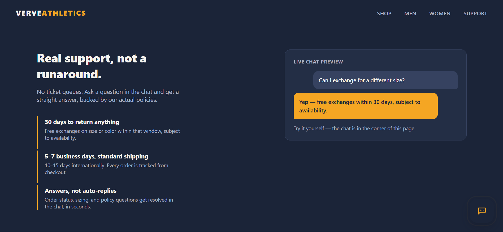
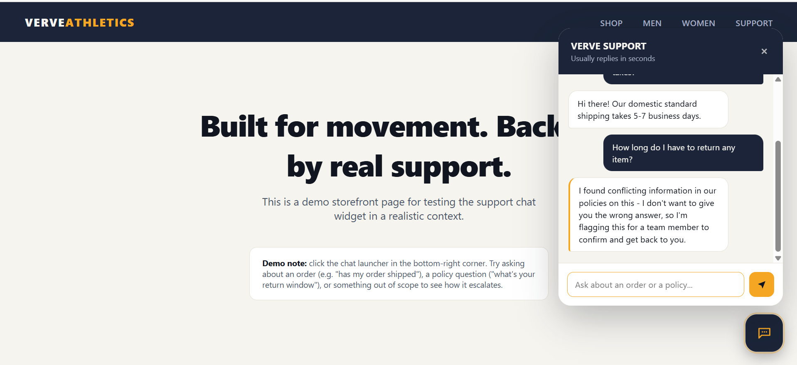
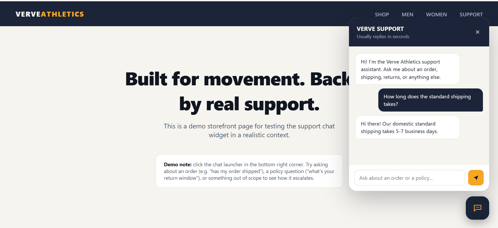
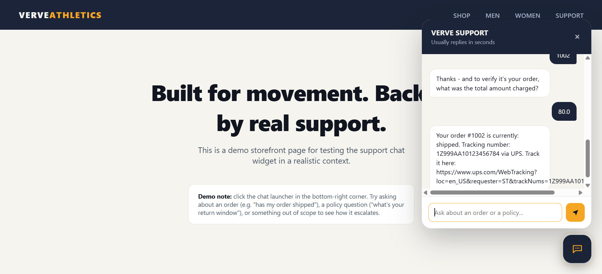
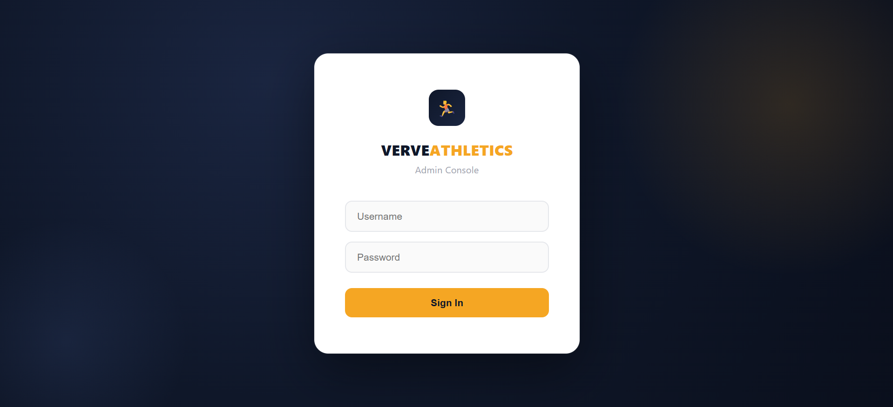
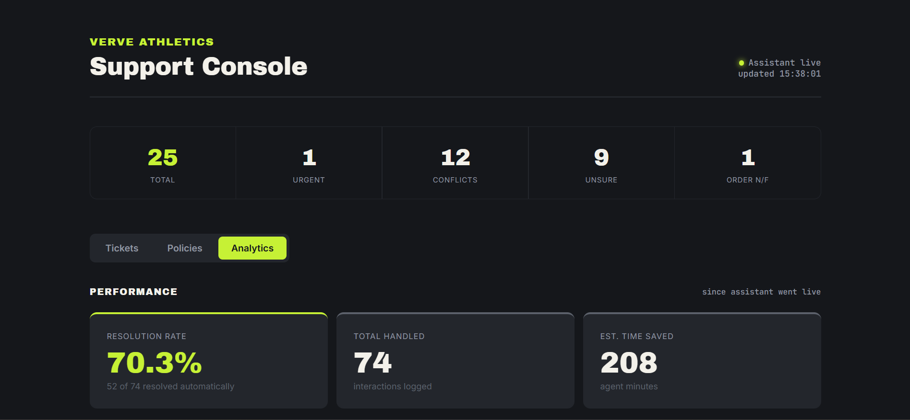
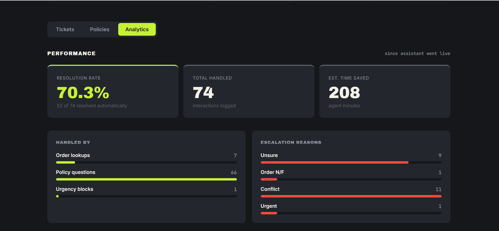
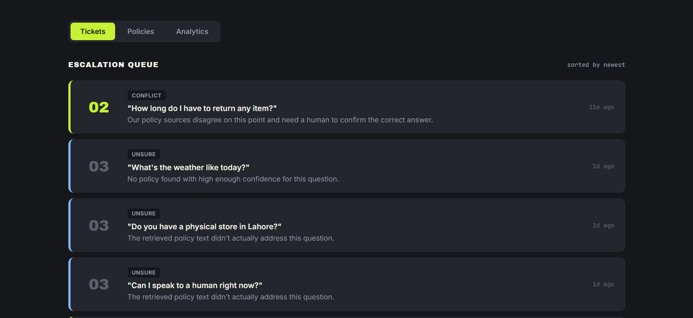
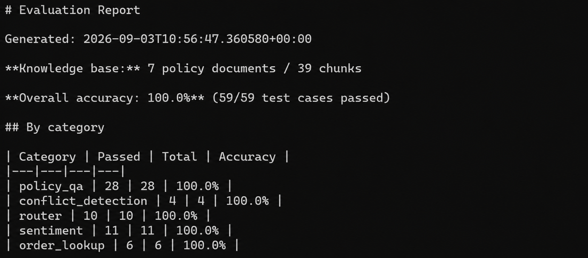

# Verve Athletics — AI Support Agent

A Shopify-integrated AI support agent with an activewear storefront demo,
a customer-facing chat widget, and an authenticated admin console.

## Live

- Storefront: https://verve-support.duckdns.org/storefront.html
- Admin console (login required): https://verve-support.duckdns.org

## Screenshots

**Storefront homepage, with the chat widget's live preview:**


**Conflict detection catching a real contradiction, live in the chat widget:**


**Answering a policy question with a live order lookup:**


**Order lookup:**


**Branded admin login:**


**Admin analytics dashboard:**


**Performance tab:**


**Escalation ticket queue:**


**Automated evaluation harness results:**


## What it does

- Answers policy questions (returns, shipping, warranty, loyalty, payments)
  from a FAISS-indexed knowledge base of policy documents.
- Detects genuine conflicts between policy documents and escalates rather
  than guessing.
- Looks up real Shopify orders by order number + total (for verification),
  returning status and tracking info.
- Flags urgent or sensitive messages (safety issues, legal threats,
  billing disputes) for human follow-up.
- Routes each message to the right handler (policy vs. order) before
  responding.

## Stack

- Flask (`chat_api.py` on port 5001, `admin_app.py` on port 5000), both
  run as persistent `systemd` services.
- nginx reverse proxy in front of both apps, real HTTPS via Let's Encrypt
  (Certbot, auto-renewing) on a free DuckDNS subdomain.
- Gemini (`gemini-3.5-flash-lite`) for the conversational layer, FAISS
  for policy-document retrieval, Shopify Admin API for order data.
- Vanilla JS chat widget (`widget.js`), no build step, embeddable via a
  single `<script>` tag.

## Setup

```bash
git clone <this-repo>
cd AI-Support-Agent
python3 -m venv venv
source venv/bin/activate
pip install -r requirements.txt
```

Create a `.env` file (not committed) with:
GEMINI_API_KEY=...
SHOPIFY_STORE_DOMAIN=...
SHOPIFY_ACCESS_TOKEN=...
ADMIN_USERNAME=...
ADMIN_PASSWORD=...
FLASK_SECRET_KEY=...

Build the policy knowledge base index (re-run any time `policy_docs/`
changes):
```bash
python -m app.core.embedder
```

Run locally:
```bash
python -m app.api.chat_api    # port 5001
python -m app.api.admin_app   # port 5000
```

In production, both run via `systemd` with `debug=False` — never enable
Flask debug mode on a publicly reachable instance.

## Project structure

- `policy_docs/` — source policy documents the agent answers from.
- `app/core/` — embedder, retrieval, conflict detection, sentiment
  detection, router.
- `app/api/` — the two Flask apps, plus `static/` (storefront, admin UI,
  login page, chat widget).
- `app/tests/` — `eval_cases.json` (test suite) and
  `evaluation_harness.py` (runs it against the live system).
- `app/data/` — generated FAISS index and `conflicts_log.json` (not
  hand-edited).

## Storefront

`storefront.html` is a self-contained demo storefront with a working
Shop section (Men/Women/Accessories filters), matched to the real
product catalog in the connected Shopify store — same names and prices
in both places. The Support section previews a real chat exchange and
links into the live widget, which loads on every page via `widget.js`.

## Security notes

- Admin console requires login (session-based, 8-hour expiry). All admin
  routes are gated by a single `before_request` hook in `admin_app.py` —
  any new public-facing static file (like the storefront page or the
  widget script) must be explicitly exempted there, or it will be
  silently blocked behind the login page.
- `/api/chat` is rate-limited (10 requests/minute/IP) to protect the
  Gemini free-tier quota.
- Flask debug mode is off in both services — leaving it on in production
  exposes the interactive Werkzeug debugger, which allows arbitrary code
  execution if triggered.
- The EC2 security group should restrict SSH to your current IP (update
  it when your ISP rotates your address) and should not expose ports
  5000/5001 to the public internet — nginx is the only intended entry
  point; those ports existing on "Anywhere" invites internet scanner
  noise for no benefit.

## Evaluation

```bash
source venv/bin/activate
python -m app.tests.evaluation_harness
```

Runs the full test suite (policy Q&A, conflict detection, routing,
sentiment, order lookup) against the live system and writes
`app/tests/evaluation_report.md`. Current result: **98%+ (59/59 on the
latest run)** — a handful of cases can occasionally hit Gemini's
free-tier rate limit mid-run and need a retry, which the harness handles
automatically via backoff.

The knowledge base includes one intentionally planted policy conflict
(order cancellation window: 1 hour per the cancellation policy vs. an
incorrect 24 hours in the FAQ) to keep the conflict-detection feature
exercised by ongoing testing — see `_conflict_manifest.md`.
